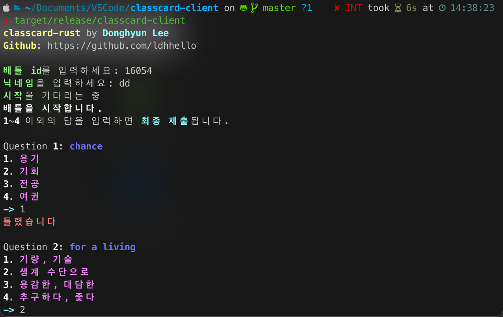

# Classcard-rust - 클래스카드 단어배틀 호환 클라이언트

#### 클래스카드 단어배틀을 이제 터미널에서 즐겨보세요!

## 빌드 하는 법
일반적인 러스트 프로젝트와 빌드 방법이 동일합니다.
```bash
cargo build --release
cargo run --release
```
를 실행해 빌드 및 실행할 수 있습니다.

## 실행 화면


## 기타
문제 발생 시 issues 탭에 올려주시거나, 아니면 디미고 3학년 4반에 직접 찾아오시면 됩니다.

코드를 잘 수정하시면 이 클라이언트가 지원하는 기능 외에도 핵에 가까운 기능을 구현하실 수 있을 지도 모릅니다. 알아서 잘 수정해 보세요